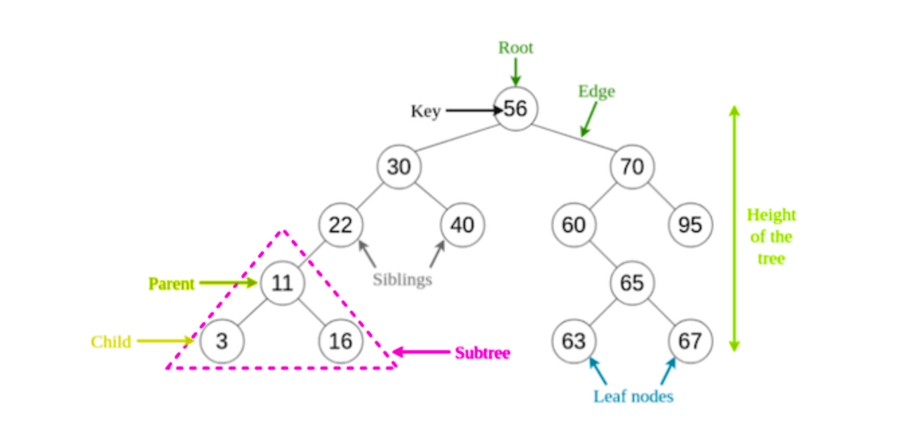

# Binary Search Tree (BST)

A binary search tree (BST) is a data structure that allows fast lookup, addition and removal of items. It works by maintaining the tree in sorted order, so that lookup and other operations can use the principle of binary search: when looking for a key in a tree (or a place to insert a new key), they traverse the tree from root to leaf (a leaf is a node with no children), making comparisons to keys stored in the nodes of the tree and deciding, on the basis of the comparison, to continue searching in the left or right subtrees.

> On average, this means that each comparison allows the operations to skip about half of the tree, so that each lookup, insertion or deletion takes time proportional to the logarithm of the number of items stored in the tree. This is much better than the linear time required to find items by key in an (unsorted) array, but slower than the corresponding operations on hash tables.



_Note: A binary search tree only has two children per node, and the left child is always less than the parent node, while the right child is always greater than the parent node._

### Every node has the following properties

- **key**: the stored value in the node
- **left**: the pointer to the left child of the node
- **right**: the pointer to the right child of the node
- **parent**: the pointer to the parent node

### BTS properties

- The **root node** is the topmost node in the tree and has no parent node
- The **left child** of a node is always less than its parent node.
- The **right child** of a node is always greater than its parent node.
- A **leaf node** is a node with no children.

### BST operations

- **insert**: insert a new node in the tree
- **search**: search a node in the tree
- **delete**: delete a node from the tree

> BST structure is widely used in different types of search operations, and other types of tree structures are used to create expression solvers and in wireless networking.

### BST pseudo code

```text
define Node class (value argument)
  value = value argument
  left = null
  right = null

define BinarySearchTree class
  initialize root with null

  define insert method (value argument)
    create a new node with value

      if root is null
        set root to new node

      else
        set current node to root

        while current node is not null
          if value is less than current node's value
            if current node's left child is null
              set current node's left child to new node
              break loop (return this)
            else
              set current node to its left child
          else if value is greater than current node's value
            if current node's right child is null
              set current node's right child to new node
              break loop
            else
              set current node to its right child
          else
            value is equal to current node's value, do nothing (return this)

  define search method (value argument)
    if root is null return false

    set current node to root

    while current node is not null
      if value is less than current node's value
        set current node to its left child
      else if value is greater than current node's value
        set current node to its right child
      else
        value is equal to current node's value, return current node
    if loop finishes, return false
```

> _Note: A Binary Search Tree can also be implemented with recursion_
