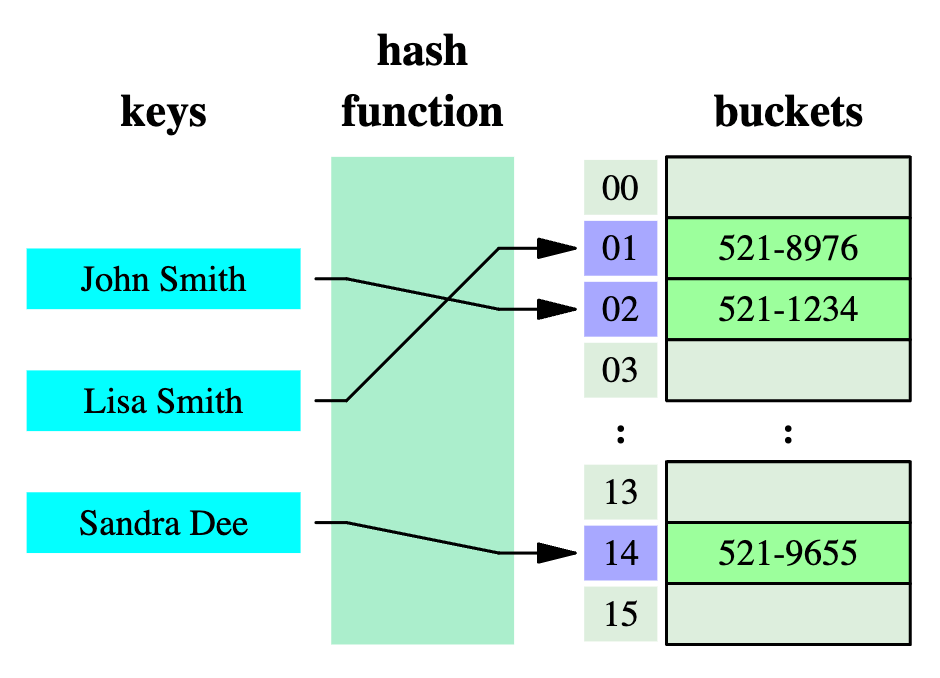

# Hash Table

A Hash Table, also known as a Hash Map, is a data structure that maps keys to values

## Overview

A Hash Table consist of an array of buckets (cells), where each bucket stores key-value pairs. The hash function is used to determine the index of the bucket where a key-value pair should be stored and retrieved

> The hash function takes a key as input and computes a hash code, which is used to calculate the index of the bucket. Ideally, the hash function should distribute keys uniformly across the array to minimize collisions



## Operations

A Hash Table supports the following operations:

- **Insert**: Insert a key-value pair into the table
- **Search**: Retrieve the value associated with a given key
- **Delete** Remove a key-value pair from the table

> Hash Tables provide constant-time average-case complexity for these operations, assuming a good hash function and an appropriately sized array.

## Load Factor

The load factor of a Hash Table is the ratio of the number of elements in the table to the size of the array.

A nice rule of thumb is to keep the load factor below 0.7 to ensure that the table is not too crowded. For every 7 data elements, there should be 10 buckets (cells) in the table

## Collision Resolution

A collision occurs when two keys map to the same index in the array. There are two main approaches to resolving collisions:

1. **Separate Chaining**: Each bucket in the array contains a linked list or another data structure to store multiple key-value pairs that map to the same index
2. **Open Addressing**: When a collision occurs, the algorithm search for the next available slot in the array and stores the key-value pair there

> The choice of collision resolution method depends on factors such as the expected number of elements, memory constraints, and the desired time complexity of the operations

## Hash Table pseudocode (built in Map)

> In Javascript you can implement a Hash Table using a Map (better) or an Object

```text
// create a new hash table
const hashTable = new Map()

// insert a new key-value pair
hashTable.set('key', 'value')

// search for a key
hashTable.get('key')

// delete a key-value pair
hashTable.delete('key')

// check if a key exists
hashTable.has('key')

// get the number of elements
hashTable.size

// iterate over the keys
for (const key of hashTable.keys()) {
  console.log(key)
}
```

## Hash Table pseudocode (own implementation)

> BEWARE: The following pseudocode implementation does not have collision handling

```text
// define the hash table class
class HashTable
  constructor()
    this.table = {}
    this.size = 0

  // define the hash function
  hash(key)
    // initialize the hash variable
    let hash = 0

    // iterate over each character in the key
    for (let i = 0; i < key.length; i++) {
      hash += key.charCodeAt(i)
    }

    // return the hash value as a string
    return hash.toString()

  // define the set method
  set(key, value)
    // get the index of the bucket
    const index = this.hash(key)

    // insert the key-value pair into the bucket
    this.table[index] = value

    // increment the size of the table
    this.size++

  // define the get method
  get(key)
    // get the index of the bucket
    const index = this.hash(key)

    // return the value stored at the index
    return this.table[index]

  // define the remove
  remove(key)
    // get the index of the bucket
    const index = this.hash(key)

    // delete the key-value pair from the bucket
    delete this.table[index]

    // decrement the size of the table
    this.size--
```

## Hash Table Performance

The performance of a Hash Table depends on several factors, including the quality of the hash function, the size of the array, and the collision resolution method. In general, Hash Tables offer the following time complexities:

| Operation | Average Case | Worst Case |
| --------- | ------------ | ---------- |
| Insert    | O(1)         | O(n)       |
| Search    | O(1)         | O(n)       |
| Delete    | O(1)         | O(n)       |

> The worst-case time complexity occurs when many collisions lead to long chains or a significant number of search operations in open addressing

## When to use a Hash Table

Hash Tables are commonly used in scenarios where fast key-value lookups are required. Some use cases include:

- Storing and retrieving data with unique keys, such as dictionaries or symbol tables
- Counting occurrences of elements ina collection
- Caching frequently accessed or computed values

> Hash Tables provide efficient average-case performance and can handle large amounts of data with good hashing and collision resolution strategies

## References

- [Hash Table Wiki](https://en.wikipedia.org/wiki/Hash_table?useskin=vector)
