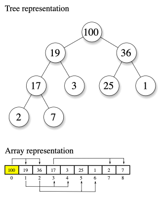

# Heap

The heap is a binary tree with two main properties:

1. It's a complete tree (all levels are completely filled except possibly the last level and the last level has all keys as left as possible)
2. Every node is greater than or equal to its children, called the heap property (max heap, min heap is the opposite)

Heaps are commonly used to implement priority queues, where the element with the highest priority (or lowest priority in the case of a min heap) can be efficiently retrieved.

> Note: We can implement a heap using an array, where the parent node of a node at index `i` is at index `floor((i - 1) / 2)`, the left child node of a node at index `i` is at index `2 * i + 1`, and the right child node of a node at index `i` is at index `2 * i + 2`.



## Types of Heaps

- **Max Heap**: In a max heap, the parent nodes have higher values than their children, with the maximum value at the root.
- **Min Heap**: In a min heap, the parent nodes have lower values than their children, with the minimum value at the root.

## Heap Operations

- **Insert**: Adds an element to the heap while maintaining the heap property.
- **Delete**: Removes the maximum (or minimum) element from the heap while maintaining the heap property.

## When to Use a Heap

- When you need to efficiently find the maximum (or minimum) element.
- When you need to maintain a dynamically changing collection of items sorted by priority.
- When you need to perform operations such as insertions and deletions efficiently.

> Note: The Heap is also used in the Heap Sort algorithm

## Heap Pseudo Code

The following pseudo code demonstrates the basic operations of a binary max heap:

```text
define Heap class
  initialize heap as an empty array

  define insert method (value argument)
    push value to the end of the heap
    bubbleUp(heap.length - 1) to restore the heap property

  define delete method
    if heap is empty, return null

    store the maximum value (root) as max
    replace the root with the last element in the heap
    remove the last element from the heap
    bubbleDown(0) to restore the heap property

  define bubbleUp method (index argument)
    store the value at the given index as value

    while index > 0
      calculate the parent index as parentIndex = floor((index - 1) / 2)
      retrieve the value of the parent node as parent

      if value <= parent
        break the loop

      set the parent's value at index
      set the value at parentIndex as value
      update the index to parentIndex

  define bubbleDown method (index argument)
    store the length of the heap as length
    store the value at the given index as value

    while true
      calculate the left child index as leftChildIndex = 2 * index + 1
      calculate the right child index as rightChildIndex = 2 * index + 2
      initialize swapIndex as null

      if leftChildIndex < length
        retrieve the value of the left child as leftChild
        if leftChild > value
          set leftChildIndex as swapIndex

      if rightChildIndex < length
        retrieve the value of the right child as rightChild
        if (swapIndex is null && rightChild > value) ||
           (swapIndex is not null && rightChild > heap[swapIndex])
          set rightChildIndex as swapIndex

      if swapIndex is null
        break the loop

      set the value at index as heap[swapIndex]
      set the value as heap[swapIndex]
      update the index to swapIndex
```

### Heap Big O

| Operation | Big O    |
| --------- | -------- |
| Insert    | O(log n) |
| Delete    | O(log n) |

> The time complexity for search in a heap is O(n) because heaps are not designed for efficient searching. If you need efficient search capabilities, consider using other data structures like binary search trees.

## References

- [Heap Wiki](https://en.wikipedia.org/wiki/Heap_%2528data_structure%2529?useskin%253Dvector)
- [Priority Queue Wiki](https://en.wikipedia.org/wiki/Priority_queue?useskin%253Dvector)
- [Binary Heap](https://en.wikipedia.org/wiki/Binary_heap?useskin%253Dvector)
