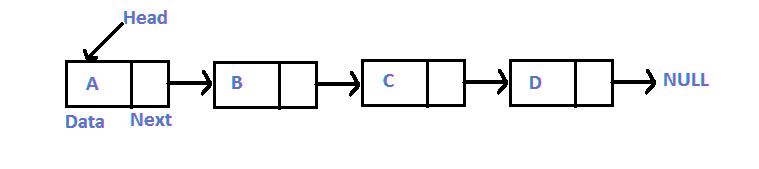
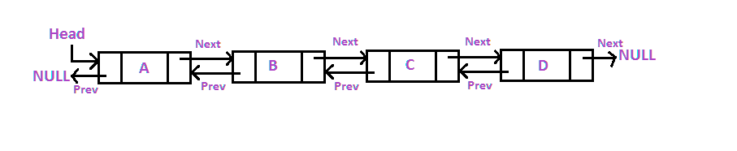

# Linked List

A Linked List consists of a sequence of nodes, where each node stores a piece of data and a reference to the next node in the sequence. The reference is often called a "link", "next", or "pointer".

It is a linear data structure, in which the elements are not stored at contiguous memory locations like an array. This structure allows for efficient insertion or removal of elements from any position in the sequence during iteration.

> The first node in the sequence is called the head, and the last node is called the tail. The head and tail nodes are special because they do not have any nodes that come before or after them, respectively.
>
> More complex variants add additional links, allowing more efficient insertion or removal of nodes at arbitrary positions. A drawback of linked lists is that access time is linear



## When to use a Linked List

- when you need constant time insertion/deletion
- when you don't know how many items are in the list
- when you don't need random access to any item in the list
- when you need to insert/remove items in the middle of the list

### When to avoid a Linked List

- when you need random access to any item in the list
- when you need to iterate through the list multiple times

## Every node has the following properties

- **value**: the stored value in the node
- **next**: the pointer to the next node in the list

### Linked List properties

- The **head** is the first node in the list and has no previous node
- The **tail** is the last node in the list and has no next node
- A **node** is a node with a value and a pointer to the next node

### Linked List operations

- **insert**: insert a new node in the list
- **search**: search a node in the list
- **delete**: delete a node from the list

> Linked list structure is used in image viewer where the user can go back and forth between images, in the undo/redo feature in text editors and browsers, in music players where the user can go back and forth between songs and more.

### Linked List pseudo code

```text
define Node class (value argument)
  value = value argument
  next = null

define LinkedList class
  initialize head with null

  define insert method (value argument)
    create a new node with value

      if head is null
        set head to new node

      else
        set current node to head

        while current node's is not null
          if current node's next is null
            set current node's next to new node
          else
            set current node to current node's next (traverse)

  define search method (value argument)
    set current node to head

    while current node is not null
      if current node's value is equal to value argument
        return current node
      else
        set current node to current node's next (traverse)

    // if after loop the value is not found return null
```

### Linked List Big O

| Operation | Big O |
| --------- | ----- |
| Insert    | O(1)  |
| Delete    | O(1)  |
| Search    | O(n)  |

## **Doubly Linked List**

A doubly linked list is a linked list where each node has a pointer to the previous node as well as the next node.



### Doubly Linked List advantages

- Allows us to iterate in both directions
- We can delete a node easily as we have access to its previous node
- Reversing is easy
- Can grow or shrink in size dynamically since we have access to the previous node

> We can insert and delete nodes at any point in the list in constant time, O(1)

## References

- [Linked List Wiki](https://en.wikipedia.org/wiki/Linked_list)
- [Doubly Linked List Wiki](https://en.wikipedia.org/wiki/Doubly_linked_list)
