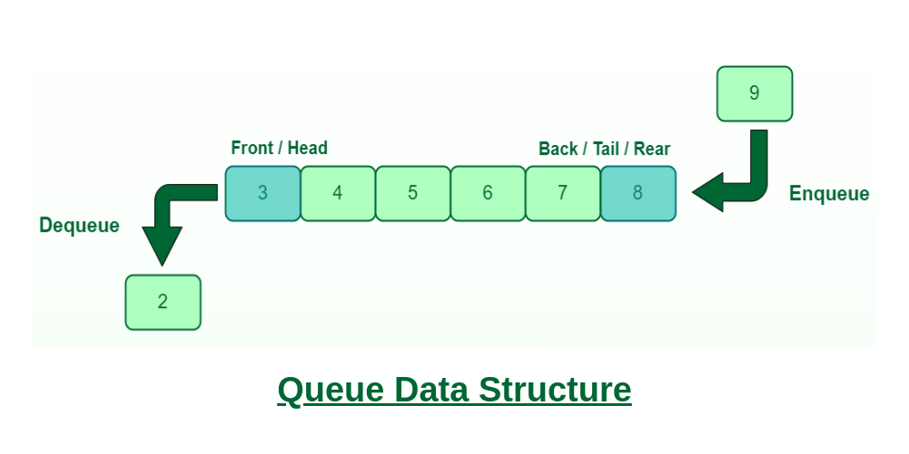

# Queue

A **queue** is a data structure that follows the **first in, first out** (FIFO) principle. It is a collection of elements that can be added and removed from the front and back of the queue. The first element added to the queue will be the first element removed from the queue.



### Queue operations

- **enqueue**: add an element to the back of the queue
- **dequeue**: remove an element from the front of the queue
- **peek**: return the front element of the queue
- **isEmpty**: check if the queue is empty
- **size**: return the size of the queue

### Queue applications

- **Printing** — A queue can be used to implement a printer queue. When a print job is sent to the printer, it is added to the queue. The printer prints the first item in the queue. When the printer is finished, it removes the item from the queue and prints the next item in the queue.

- **Waiting list** — A queue can be used to implement a waiting list. When a person is added to the waiting list, they are added to the back of the queue. When a person is removed from the waiting list, they are removed from the front of the queue.

- **Traffic** — A queue can be used to simulate traffic. When a car enters the intersection, it is added to the queue. When the light turns green, the first car in the queue is removed and allowed to pass through the intersection.

### Queue pseudo code

```text
define Queue class
  initialize items with empty array

  define enqueue method (item argument)
    add item to items

  define dequeue method
    remove first item from items

  define peek method
    return first item from items

  define isEmpty method
    return true if items is empty, otherwise return false

  define size method
    return length of items
```

### Queue resources

- [Queue](<https://en.wikipedia.org/wiki/Queue_(abstract_data_type)>)

&nbsp;

---

&nbsp;

[**Go To Top &nbsp; ⬆️**](#queue)

[**← Go Back**](../README.md)

&nbsp;
