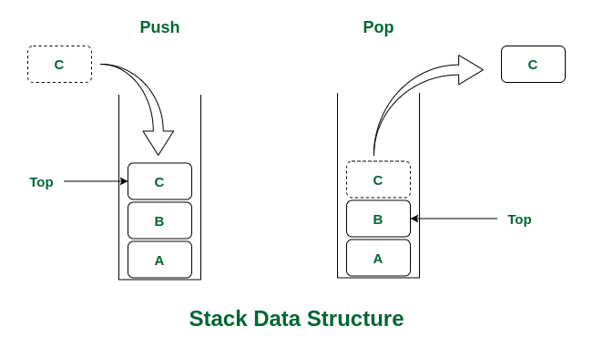

# Stack

A **stack** is a data structure that follows the **last in, first out** (LIFO) principle. It is a collection of elements that can be added and removed from the top of the stack. The last element added to the stack will be the first element removed from the stack.



### Stack operations

- **push**: add an element to the top of the stack
- **pop**: remove an element from the top of the stack
- **peek**: return the top element of the stack
- **isEmpty**: check if the stack is empty
- **size**: return the size of the stack

### Stack applications

- **Reversing** — A stack can be used to reverse a string. A string is pushed onto the stack one character at a time. The characters are popped off the stack and added to a new string. The new string is the reverse of the original string.

- **Undo** — A stack can be used to implement an undo feature. Each time a user performs an action, the action is pushed onto the stack. When the user wants to undo an action, the top item is popped off the stack and the action is undone.

- **Backtracking** — A stack can be used to implement a backtracking algorithm. A backtracking algorithm is an algorithm that tries to solve a problem by exploring all possible solutions. A stack can be used to keep track of the different possible solutions. When a solution is found, it is pushed onto the stack. If a solution is not found, the top item is popped off the stack and the algorithm tries a different solution.

- **Call stack** — A stack is used to keep track of function calls in a program. When a function is called, it is pushed onto the stack. When a function returns, the top item is popped off the stack.

### Stack pseudo code

```text
define Stack class
  initialize items with empty array

  define push method (item argument)
    add item to items

  define pop method
    remove last item from items

  define peek method
    return last item from items

  define isEmpty method
    return true if items is empty, otherwise return false

  define size method
    return length of items
```

## References

- [Stack Wiki](<https://en.wikipedia.org/wiki/Stack_(abstract_data_type)>)

&nbsp;

---

&nbsp;

[**Go To Top &nbsp; ⬆️**](#stack)

[**← Go Back**](../README.md)

&nbsp;
