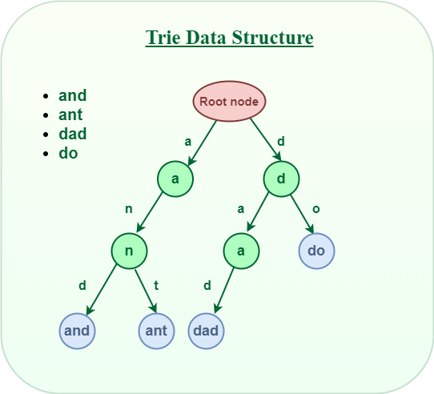

# Trie

A Trie, also known as a prefix tree or digital tree, is a tree-based data structure used for efficient retrieval of keys in a large set of strings. It is often used for applications that involve searching for strings or performing prefix-based operations such as auto-complete and spell-checking

> Note: The name comes from the word retrieval, but is pronounced like "try" to avoid confusion with the word tree



> Image from [geeksforgeeks.org](https://www.geeksforgeeks.org/trie-insert-and-search/)

## Structure

A Trie is composed of nodes, where each node represents a character in a string. The nodes are connected by links, which are labeled with characters. The root node represents an empty string or the starting point of the Trie

Each node in the Trie can have multiple child nodes, each representing a possible character that can follow the current node. The links between nodes represent the characters that form the strings

## Trie Node

A Trie node typically contains the following properties:

- `children`: A list or object (hash table) containing references to child nodes as values and characters as keys
- `isEndOfWord`: A boolean value indicating whether the node represents the end of a string

> Note: In my implementation I didn't use the isEndOfWord property, instead I added a key ('\*') to the children object to indicate the end of a word

## Operations

The main operations performed on a Trie include:

- `insert`: Inserts a string into the Trie
- `search`: Searches for a string in the Trie
- `delete`: Deletes a string from the Trie
- `startsWith`: Checks if a string is a prefix of any string in the Trie

## Pseudo Code

```text
define TrieNode class
  initialize children as an empty object

define Trie class
  set root to a new TrieNode

  define insert method (word argument)
    set currentNode to root

    for each character, char, in word
      if currentNode's children does not have char
        create a new TrieNode and assign it to currentNode's children with key char

      set currentNode to currentNode's children with key char

    assign true to currentNode's children with key '*'

  define search method (word argument)
    set currentNode to root

    for each character, char, in word
      if currentNode's children does not have char
        return false

      set currentNode to currentNode's children with key char

    return true if currentNode's children with key '*' is true, otherwise return false
```

## Trie Example

Suppose we have the following strings to be inserted into a Trie: "apple," "application," "app," and "banana."

The resulting Trie would look like:

```text
        root
       /    \
      a      b
     / \      \
    p   p      a
   /   / \      \
  p   l   p      n
 /   /     \      \
l   e       i      a
             \      \
              c      n
               \      \
                a      a
                 \      \
                  t      n
                   \      \
                    i      a
                     \
                      o
                      \
                       n
```

## Time Complexity

The time complexity of the Trie operations are as follows:

| Operation | Time Complexity |
| --------- | --------------- |
| Insert    | O(k)            |
| Search    | RoO(k)          |
| O(k)      | O(k)            |

> Note: k is the length of the string being inserted or searched for. The time complexity of O(k) does NOT grow with the number of strings in the Trie but with the number of characters in the string which is really fast (close to O(1))
>
> Beware: The space complexity of a Trie is O(n) where n is the total number of characters in the Trie. It can be relatively high if the Trie contains a large number of strings with common prefixes

## References

- [Wikipedia](https://en.wikipedia.org/wiki/Trie)

&nbsp;

---

&nbsp;

[**Go To Top &nbsp; ⬆️**](#trie)

[**← Go Back**](../README.md)

&nbsp;
